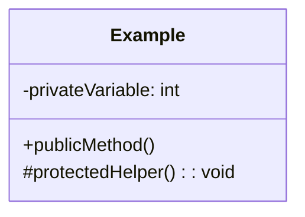
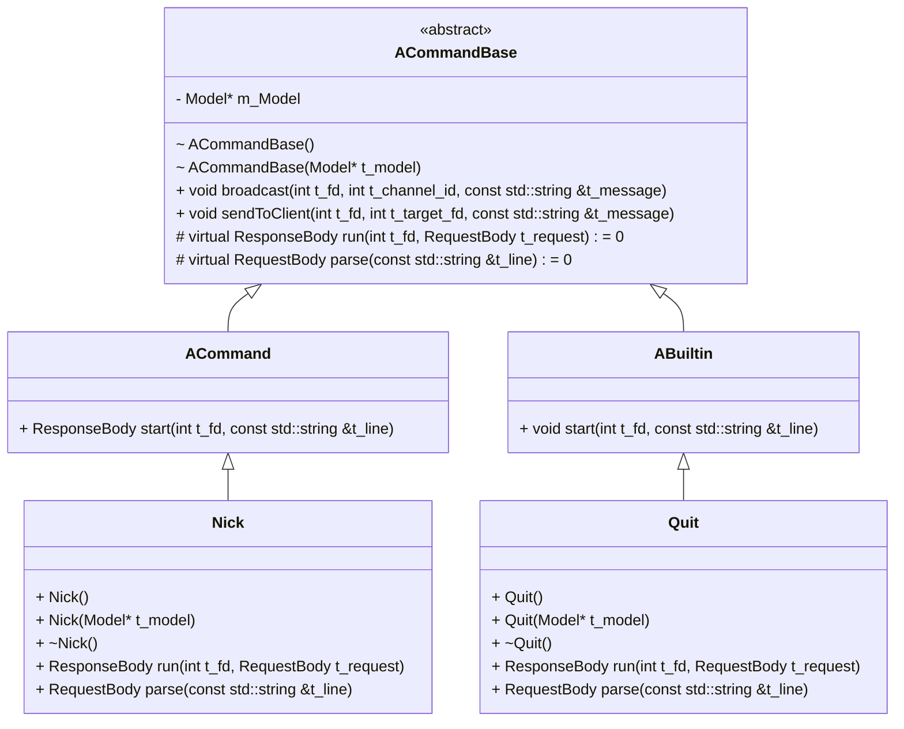
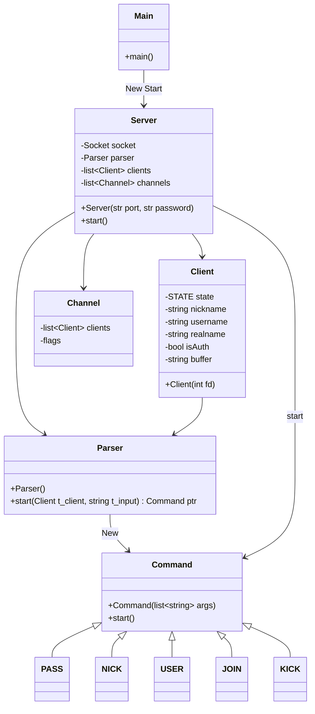

```mermaid
classDiagram

class Example {
    +publicMethod()
    -privateVariable: int
    #protectedHelper(): void
}
```

```mermaid
classDiagram
    class ACommandBase {
        - Model* m_Model
        ~ ACommandBase()
        ~ ACommandBase(Model* t_model)
        <<abstract>>
        + void broadcast(int t_fd, int t_channel_id, const std::string &t_message)
        + void sendToClient(int t_fd, int t_target_fd, const std::string &t_message)
        # virtual ResponseBody run(int t_fd, RequestBody t_request) = 0
        # virtual RequestBody parse(const std::string &t_line) = 0
    }

    class ACommand {
        + ResponseBody start(int t_fd, const std::string &t_line)
    }

    class ABuiltin {
        + void start(int t_fd, const std::string &t_line)
    }

    class Nick {
        + Nick()
        + Nick(Model* t_model)
        + ~Nick()
        + ResponseBody run(int t_fd, RequestBody t_request)
        + RequestBody parse(const std::string &t_line)
    }

    class Quit {
        + Quit()
        + Quit(Model* t_model)
        + ~Quit()
        + ResponseBody run(int t_fd, RequestBody t_request)
        + RequestBody parse(const std::string &t_line)
    }

    ACommandBase <|-- ACommand
    ACommandBase <|-- ABuiltin
    ACommand <|-- Nick
    ABuiltin <|-- Quit
```

```mermaid
classDiagram

class Main {
    +main()
}

class Server {
    -Socket socket
    -Parser parser
    -list~Client~ clients
    -list~Channel~ channels
    +Server(str port, str password)
    +start()
}

class Client {
    -STATE state
    -string nickname
    -string username
    -string realname
    -bool isAuth
    -string buffer
    +Client(int fd)
}

class Parser {
    <!-- -config -->
    +Parser()
    +start(Client t_client, string t_input) Command ptr
}

class Channel {
    -list~Client~ clients
    -flags
}

class Command {
    +Command(list~string~ args)
    +start()
}

class PASS
class NICK
class USER
class JOIN
class KICK

Main --> Server: New Start
Server --> Client
Server --> Channel
Server --> Parser
Parser --> Command: New
Client --> Parser
Server --> Command: start
Command <|-- PASS
Command <|-- NICK
Command <|-- USER
Command <|-- JOIN
Command <|-- KICK
```
