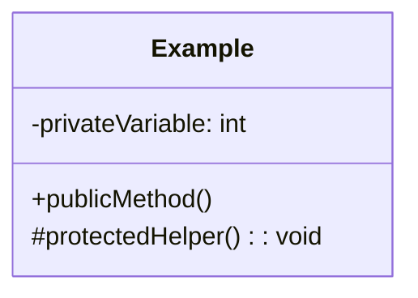
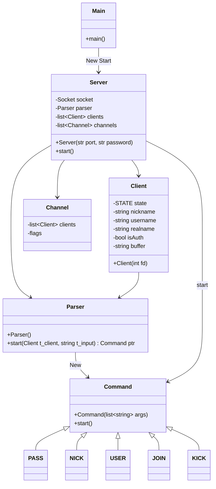

```mermaid
classDiagram

class Example {
    +publicMethod()
    -privateVariable: int
    #protectedHelper(): void
}
```

```mermaid
classDiagram

class Main {
    +main()
}

class Server {
    -Socket socket
    -Parser parser
    -list~Client~ clients
    -list~Channel~ channels
    +Server(str port, str password)
    +start()
}

class Client {
    -STATE state
    -string nickname
    -string username
    -string realname
    -bool isAuth
    -string buffer
    +Client(int fd)
}

class Parser {
    <!-- -config -->
    +Parser()
    +start(Client t_client, string t_input) Command ptr
}

class Channel {
    -list~Client~ clients
    -flags
}

class Command {
    +Command(list~string~ args)
    +start()
}

class PASS
class NICK
class USER
class JOIN
class KICK

Main --> Server: New Start
Server --> Client
Server --> Channel
Server --> Parser
Parser --> Command: New
Client --> Parser
Server --> Command: start
Command <|-- PASS
Command <|-- NICK
Command <|-- USER
Command <|-- JOIN
Command <|-- KICK
```
