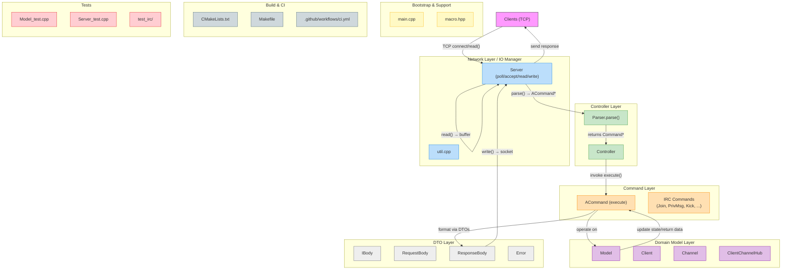

```mermaid
flowchart TB
    %% External Actors
    Clients["Clients (TCP)"]:::external

    %% Network Layer
    subgraph "Network Layer / IO Manager"
        direction TB
        ServerNode["Server (poll/accept/read/write)"]:::network
        Util["util.cpp"]:::network
    end

    %% Controller Layer
    subgraph "Controller Layer"
        direction TB
        ParserNode["Parser.parse()"]:::controller
        ControllerNode["Controller"]:::controller
    end

    %% Command Layer
    subgraph "Command Layer"
        direction TB
        ACommandNode["ACommand (execute)"]:::command
        ConcreteCommands["IRC Commands\n(Join, PrivMsg, Kick, ...)"]:::command
    end

    %% Domain Model Layer
    subgraph "Domain Model Layer"
        direction TB
        ModelNode["Model"]:::domain
        ClientNode["Client"]:::domain
        ChannelNode["Channel"]:::domain
        HubNode["ClientChannelHub"]:::domain
    end

    %% DTO Layer
    subgraph "DTO Layer"
        direction TB
        IBody["IBody"]:::dto
        RequestBody["RequestBody"]:::dto
        ResponseBody["ResponseBody"]:::dto
        ErrorBody["Error"]:::dto
    end

    %% Application Bootstrap & Support
    subgraph "Bootstrap & Support"
        direction TB
        Main["main.cpp"]:::support
        Macro["macro.hpp"]:::support
    end

    %% Build & CI
    subgraph "Build & CI"
        direction TB
        CMake["CMakeLists.txt"]:::build
        MakefileNode["Makefile"]:::build
        CI[".github/workflows/ci.yml"]:::build
    end

    %% Testing
    subgraph "Tests"
        direction TB
        ModelTest["Model_test.cpp"]:::test
        ServerTest["Server_test.cpp"]:::test
        IRCTest["test_irc/"]:::test
    end

    %% Data Flow
    Clients -->|"TCP connect/read()"| ServerNode
    ServerNode -->|"read() → buffer"| ServerNode
    ServerNode -->|"parse() → ACommand*"| ParserNode
    ParserNode -->|"returns Command*"| ControllerNode
    ControllerNode -->|"invoke execute()"| ACommandNode
    ACommandNode -->|"operate on"| ModelNode
    ModelNode -->|"update state/return data"| ACommandNode
    ACommandNode -->|"format via DTOs"| ResponseBody
    ResponseBody -->|"write() → socket"| ServerNode
    ServerNode -->|"send response"| Clients

    %% Click Events
    click ServerNode "https://github.com/qwertop18/irc/blob/main/srcs/server/Server.hpp"
    click Util "https://github.com/qwertop18/irc/blob/main/srcs/server/util.cpp"
    click ParserNode "https://github.com/qwertop18/irc/blob/main/srcs/Controller/Parser.hpp"
    click ControllerNode "https://github.com/qwertop18/irc/blob/main/srcs/Controller/Controller.hpp"
    click ACommandNode "https://github.com/qwertop18/irc/blob/main/srcs/command/ACommand.hpp"
    click ModelNode "https://github.com/qwertop18/irc/blob/main/srcs/Model/Model.hpp"
    click ClientNode "https://github.com/qwertop18/irc/blob/main/srcs/Model/Client.hpp"
    click ChannelNode "https://github.com/qwertop18/irc/blob/main/srcs/Model/Channel.hpp"
    click HubNode "https://github.com/qwertop18/irc/blob/main/srcs/Model/ClientChannelHub.hpp"
    click IBody "https://github.com/qwertop18/irc/blob/main/srcs/DTO/IBody.hpp"
    click RequestBody "https://github.com/qwertop18/irc/blob/main/srcs/DTO/RequestBody.hpp"
    click ResponseBody "https://github.com/qwertop18/irc/blob/main/srcs/DTO/ResponseBody.hpp"
    click ErrorBody "https://github.com/qwertop18/irc/blob/main/srcs/DTO/Error.hpp"
    click Main "https://github.com/qwertop18/irc/blob/main/srcs/main.cpp"
    click Macro "https://github.com/qwertop18/irc/blob/main/srcs/macro.hpp"
    click CMake "https://github.com/qwertop18/irc/blob/main/CMakeLists.txt"
    click MakefileNode "https://github.com/qwertop18/irc/tree/main/Makefile"
    click CI "https://github.com/qwertop18/irc/blob/main/.github/workflows/ci.yml"
    click ModelTest "https://github.com/qwertop18/irc/blob/main/test/Model_test.cpp"
    click ServerTest "https://github.com/qwertop18/irc/blob/main/test/Server_test.cpp"
    click IRCTest "https://github.com/qwertop18/irc/tree/main/test_irc/"

    %% Styles
    classDef external fill:#f9f,stroke:#333,stroke-width:1px
    classDef network fill:#bbdefb,stroke:#1e88e5,stroke-width:1px
    classDef controller fill:#c8e6c9,stroke:#43a047,stroke-width:1px
    classDef command fill:#ffe0b2,stroke:#fb8c00,stroke-width:1px
    classDef domain fill:#e1bee7,stroke:#8e24aa,stroke-width:1px
    classDef dto fill:#eeeeee,stroke:#757575,stroke-width:1px
    classDef support fill:#fff9c4,stroke:#fbc02d,stroke-width:1px
    classDef build fill:#cfd8dc,stroke:#546e7a,stroke-width:1px
    classDef test fill:#ffcdd2,stroke:#e53935,stroke-width:1px

```
