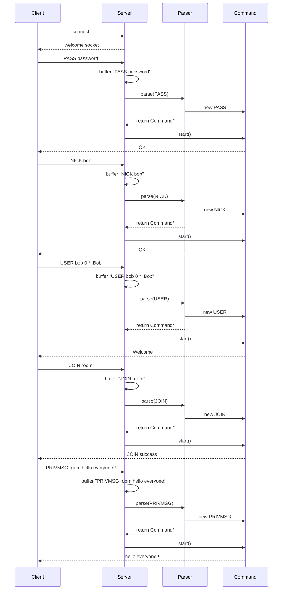

```mermaid
sequenceDiagram

    participant Client
    participant Server
    participant Parser
    participant Command

    Client->>Server: connect
    Server-->>Client: welcome socket

    Client->>Server: PASS password
    Server->>Server: buffer "PASS password"
    Server->>Parser: parse(PASS)
    Parser->>Command: new PASS
    Parser-->>Server: return Command*
    Server->>Command: start()
    Command-->>Client: OK

    Client->>Server: NICK bob
    Server->>Server: buffer "NICK bob"
    Server->>Parser: parse(NICK)
    Parser->>Command: new NICK
    Parser-->>Server: return Command*
    Server->>Command: start()
    Command-->>Client: OK

    Client->>Server: USER bob 0 * :Bob
    Server->>Server: buffer "USER bob 0 * :Bob"
    Server->>Parser: parse(USER)
    Parser->>Command: new USER
    Parser-->>Server: return Command*
    Server->>Command: start()
    Command-->>Client: :Welcome

    Client->>Server: JOIN room
    Server->>Server: buffer "JOIN room"
    Server->>Parser: parse(JOIN)
    Parser->>Command: new JOIN
    Parser-->>Server: return Command*
    Server->>Command: start()
    Command-->>Client: JOIN success

    Client->>Server: PRIVMSG room hello everyone!!
    Server->>Server: buffer "PRIVMSG room hello everyone!!"
    Server->>Parser: parse(PRIVMSG)
    Parser->>Command: new PRIVMSG
    Parser-->>Server: return Command*
    Server->>Command: start()
    Command-->>Client: hello everyone!!

```
